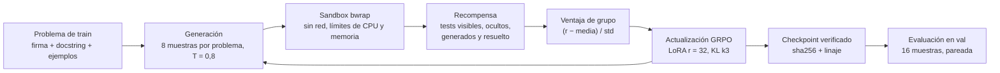
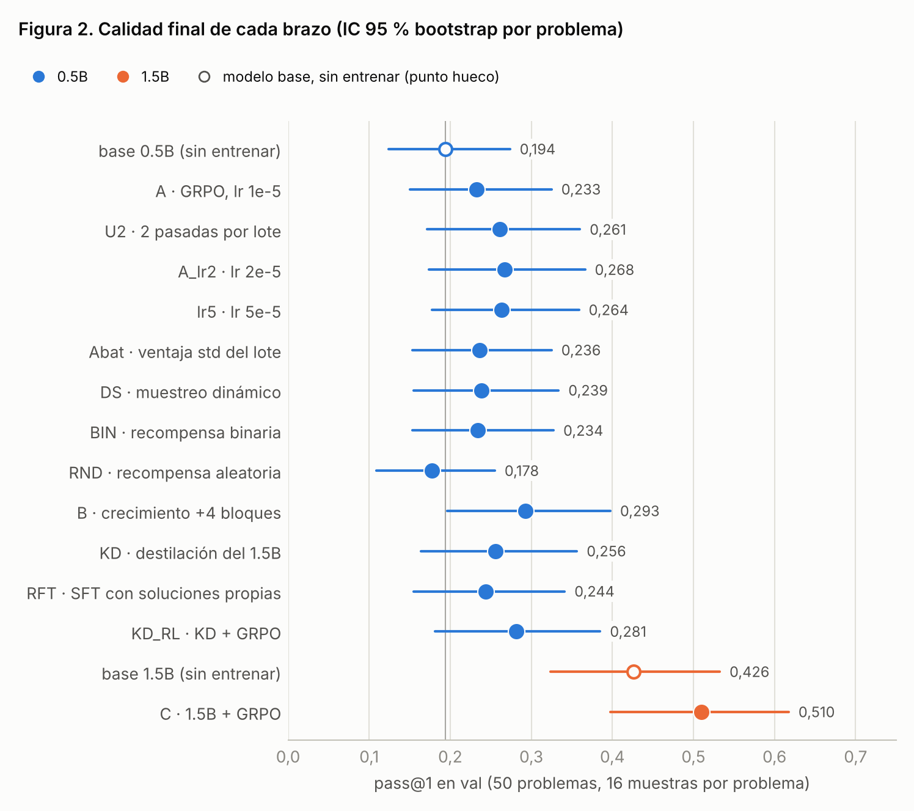
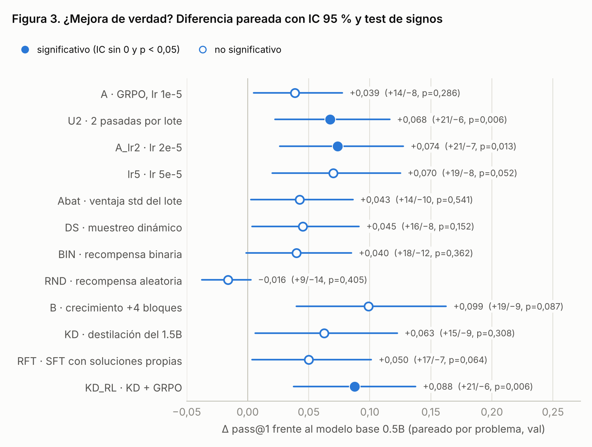
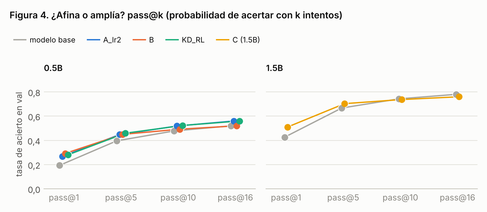
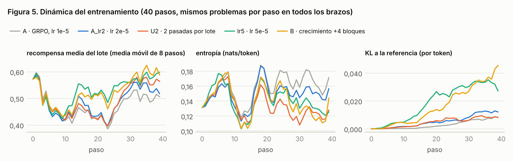
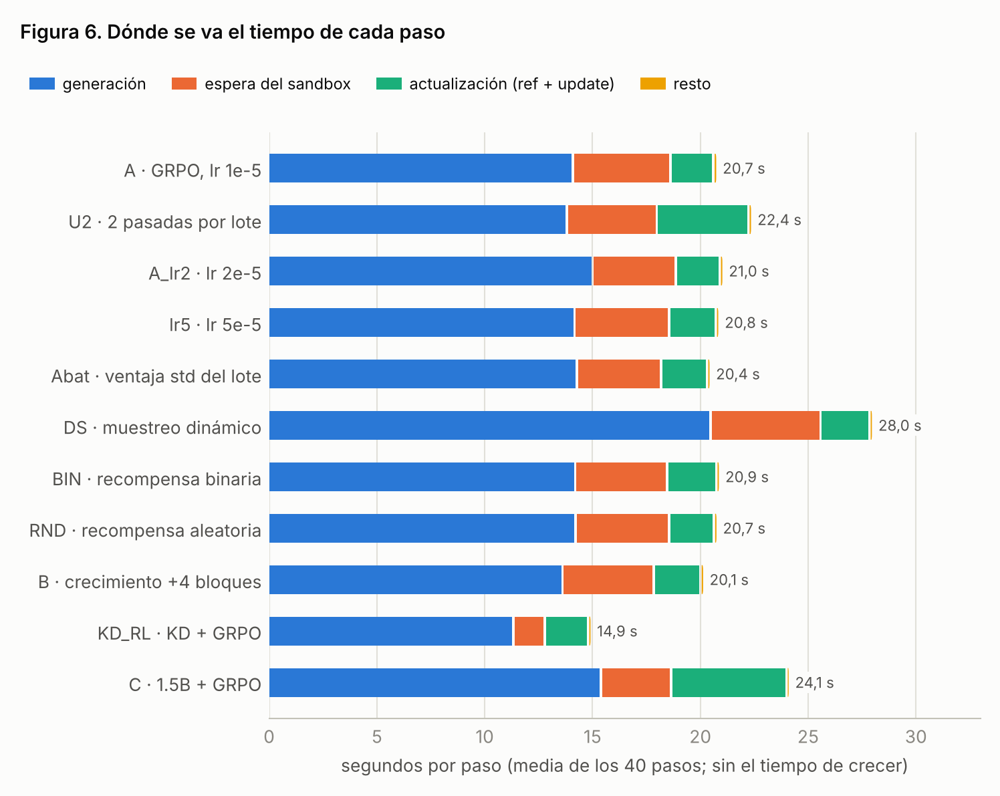
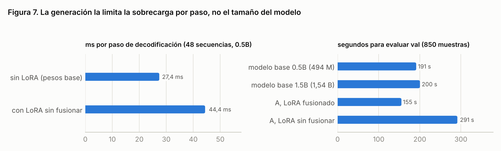
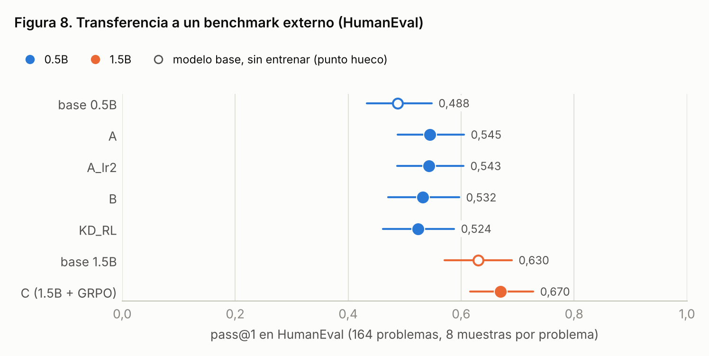
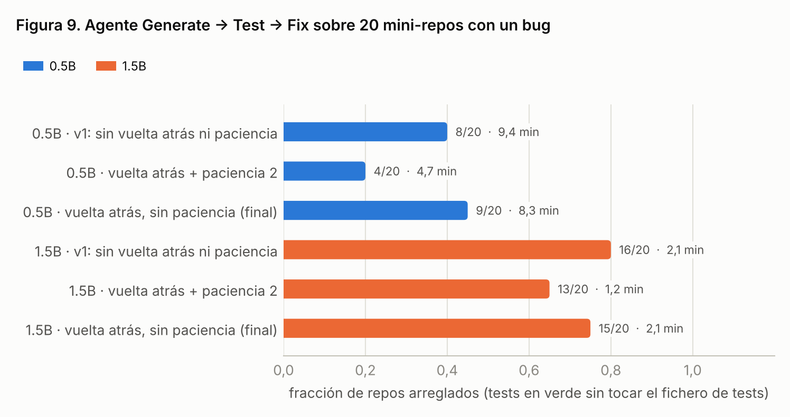

# Entrenar un modelo de código pequeño con RL en una sola GPU de consumo: qué funciona, qué no y por qué

**Qwen2.5-Coder 0.5B / 1.5B · GRPO + LoRA · recompensas verificables en un sandbox · RTX 5070 (12 GB) bajo WSL2**

Octubre de 2026 · código, datos y resultados en este repositorio (`runs/` no se sube: ver [Reproducibilidad](#9-reproducibilidad))

---

## Resumen

Estudiamos cómo mejorar un modelo de código pequeño (Qwen2.5-Coder-0.5B-Instruct) con aprendizaje por refuerzo con
recompensas verificables: el modelo escribe una función, un sandbox la ejecuta contra tests y GRPO con LoRA actualiza
la política, todo en una única GPU de 12 GB. Con un diseño de **brazos comparables** (mismos datos, semilla, problemas
en cada paso y evaluación) y **evaluación pareada por problema** (bootstrap + test de signos; efecto mínimo detectable
≈ 0,05), comparamos 13 brazos: tasa de aprendizaje, pasadas por lote, normalización de la ventaja, muestreo
dinámico, recompensa binaria, un control con recompensa aleatoria, crecimiento en profundidad del modelo, destilación
desde un modelo mayor y un modelo 3× mayor.

Resultados principales:

1. **40 pasos de GRPO suben pass@1 en val de 0,194 a 0,233–0,293**; tres variantes (+0,07 a +0,09) superan los dos
   criterios de significación. **Ninguna cambia pass@16 de forma significativa** (como mucho, 3 problemas netos de 50;
   p ≥ 0,37): el RL afina lo que el modelo ya sabía, no amplía lo que sabe.
2. **Ninguna variante del 0.5B supera de forma fiable a la receta más simple** (una actualización por lote, lr
   1e-5–2e-5). En concreto, la hipótesis "una sola actualización por lote limita el aprendizaje" es falsa: dos pasadas
   por lote no ganan más que una sola con el doble de lr (Δ = −0,006, p = 0,82) y cuestan más.
3. **El factor dominante es el tamaño del modelo.** El 1.5B *sin entrenar* (0,426) supera a todas las variantes
   entrenadas del 0.5B (≤ 0,293); con el mismo entrenamiento llega a **0,510** (+0,084 sobre su base, p = 0,0003),
   con un coste por paso casi igual (24 s frente a 21 s), porque la generación está limitada por la sobrecarga de
   lanzar kernels, no por el cómputo.
4. **Crecer y destilar no superan a la receta simple.** Añadir 4 bloques al modelo (+60 M parámetros) y destilar 229
   soluciones del 1.5B no superan de forma significativa a la receta con lr 2e-5 (el crecimiento sí supera a la de
   1e-5 en val, +0,060, p = 0,043, pero no en HumanEval); con tan pocos problemas, la destilación memoriza el conjunto
   de entrenamiento.
5. **Los controles lo confirman.** Con una recompensa aleatoria (RND) no hay mejora (−0,016 frente a la base); con
   recompensa binaria (BIN), lo mismo que con crédito parcial. Y las ganancias de GRPO se mantienen fuera de nuestro
   catálogo: en HumanEval, A, A_lr2 y B suben pass@1 entre +0,044 y +0,057 y C, +0,040 sobre el 1.5B (todas
   significativas); la destilación transfiere menos (+0,036, no significativa).
6. **Agente Generate → Test → Fix.** Tras corregir dos fallos del propio agente (un comando de tests que dependía de
   pytest y respuestas correctas descartadas por formato), arregla 15–16 de 20 mini-repos con el 1.5B y 8–9 con el
   0.5B (antes, 0). Una de las mejoras propuestas al bucle (parar por paciencia) resultó perjudicial (−7 repos de 40)
   y queda desactivada.

Por el camino documentamos y corregimos fallos de ingeniería que invalidaban mediciones (paginación de VRAM en WSL,
dos implementaciones de GRPO incoherentes, un token de relleno entrenado como si lo hubiera elegido el modelo,
rollouts no reproducibles, un veredicto estadístico anticonservador y un benchmark de agente que nunca podía pasar).

---

## Índice

1. [Introducción](#1-introducción)
2. [Trabajo relacionado](#2-trabajo-relacionado)
3. [Sistema](#3-sistema)
4. [Diseño experimental](#4-diseño-experimental)
5. [Resultados](#5-resultados)
6. [Discusión](#6-discusión)
7. [Limitaciones y amenazas a la validez](#7-limitaciones-y-amenazas-a-la-validez)
8. [Conclusiones y siguiente paso](#8-conclusiones-y-siguiente-paso)
9. [Reproducibilidad](#9-reproducibilidad)
10. [Referencias](#10-referencias)
- [Apéndice A: auditoría de ingeniería](#apéndice-a-auditoría-de-ingeniería)
- [Apéndice B: cambios descartados](#apéndice-b-cambios-descartados)
- [Apéndice C: tests](#apéndice-c-tests)

---

## 1. Introducción

Los modelos de código de 0,5–1,5 B parámetros caben en una GPU doméstica y responden rápido, pero fallan a menudo.
El aprendizaje por refuerzo con recompensas verificables (RLVR) —generar código, ejecutarlo contra tests y premiar lo
que pasa— es la receta que ha mejorado el razonamiento y la programación de modelos grandes (DeepSeekMath, DeepSeek-R1).
Este trabajo pregunta qué parte de esa receta funciona **a escala doméstica**: una RTX 5070 de 12 GB bajo WSL2, un
modelo de 0,5 B (Qwen2.5-Coder-0.5B-Instruct; Hui et al., 2024) y un presupuesto de minutos por experimento.

Preguntas de investigación:

| | Pregunta | Brazos |
|---|---|---|
| RQ1 | ¿Limita el aprendizaje hacer una sola actualización por lote de rollouts? | A, U2, A_lr2 |
| RQ2 | ¿Qué tasa de aprendizaje para LoRA en RL? | A (1e-5), A_lr2 (2e-5), lr5 (5e-5) |
| RQ3 | ¿Ayudan las variantes de GRPO propuestas en la literatura? | Abat, DS, BIN |
| RQ4 | ¿La mejora viene de la señal de los tests o de cualquier recompensa? | RND (control) |
| RQ5 | ¿Añadir capas al modelo (crecer) ayuda? | B |
| RQ6 | ¿Destilar de un modelo mayor ayuda? | KD, RFT (control), KD_RL |
| RQ7 | ¿Cuánto aporta un modelo 3× mayor con el mismo entrenamiento? | base 1.5B, C |
| RQ8 | ¿Lo aprendido transfiere fuera de nuestro catálogo? | HumanEval |
| RQ9 | ¿Dónde se va el tiempo y qué limita la velocidad? | todos |

Contribuciones: (i) un banco de pruebas reproducible para RL de código en una GPU de consumo, con sandbox aislado,
checkpoints verificados y telemetría por paso; (ii) una comparación controlada y pareada de 13 brazos con reglas
de decisión fijadas antes de ver los resultados; (iii) evidencia de que, a esta escala, el tamaño del modelo pesa más
que cualquier ajuste del algoritmo; (iv) un análisis del coste que muestra que la generación está limitada por la
sobrecarga de lanzamiento de kernels.

## 2. Trabajo relacionado

**GRPO y variantes.** GRPO (Shao et al., 2024) sustituye el crítico de PPO (Schulman et al., 2017) por la media de
un grupo de respuestas al mismo prompt. Dr. GRPO (Liu et al., 2025) señala sesgos en la normalización por la desviación
típica del grupo y por la longitud; Lite PPO (Liu et al., 2025b) propone normalizar con la desviación típica del lote;
DAPO (Yu et al., 2025) añade *clip-higher*, muestreo dinámico de grupos con varianza y pérdida por token.

**Límites del RL.** Yue et al. (2025) muestran que el RLVR sube pass@1 pero no pass@k para k grande: reordena la
probabilidad de soluciones que el modelo base ya podía generar. Shao et al. (2025) muestran que, en modelos Qwen,
incluso recompensas aleatorias pueden "mejorar" métricas, lo que obliga a usar controles.

**Crecer el modelo.** LLaMA Pro (Wu et al., 2024) añade bloques Transformer inicializados como identidad (proyecciones
de salida a cero) y entrena sólo los nuevos, conservando la función del modelo al crecer.

**Destilación.** ReST-EM (Singh et al., 2023) y STaR (Zelikman et al., 2022) entrenan con las propias soluciones
verificadas del modelo; DeepSeek-R1 (2025) concluye que destilar un modelo más capaz en uno pequeño supera al RL a gran
escala sobre el pequeño; GKD (Agarwal et al., 2024) lo hace sobre la política del alumno.

**Evaluación.** pass@k con el estimador insesgado de Chen et al. (2021); errores estándar y comparación pareada por
pregunta según Miller (2024).

## 3. Sistema


*Figura 1. Bucle de entrenamiento.*

**Tarea.** Cada problema da una firma, un docstring y ejemplos visibles; el modelo escribe la función completa (la
respuesta empieza en <code>```python</code> y para en el cierre del bloque).

**Recompensa** (crédito parcial, en [0, 1]):
R = 0,05·compila + 0,10·visibles + 0,25·ocultos* + 0,20·generados* + 0,40·resuelto, donde * corrige por azar (un
predictor que devuelve siempre lo mismo obtiene 0) y "resuelto" exige pasar todo. Código con imports o llamadas no
permitidos: −0,5.

**Sandbox.** Cada programa corre con bubblewrap: sin red, sin acceso al proyecto, `/usr` de sólo lectura, sin
`fork`, 1 GB de memoria, 2 s por caso, hasta 4 timeouts y 20 s en total.

**Entrenamiento.** GRPO con 6 problemas × 8 muestras por paso, ventaja `(r − media del grupo) / std del grupo`,
pérdida media por token, KL k3 a la referencia (coeficiente 0,04; la referencia es el mismo modelo con LoRA apagado,
sin segunda copia en VRAM), log-probabilidades a la temperatura de muestreo, sin dropout (on-policy), LoRA (Hu et
al., 2021) r=32 / α=64 en las 7 proyecciones lineales (17,6 M parámetros entrenables), AdamW. Las log-probabilidades se calculan sólo
sobre los tokens de respuesta, con la cabeza de vocabulario aplicada por trozos y recalculada en el backward (sin
materializar logits de 151 936 columnas): pico de memoria extra 0,87 GB frente a 3,99 GB.

**Reproducibilidad interna.** Los rollouts de cada paso se siembran con (semilla, paso): dos brazos con los mismos
pesos generan exactamente los mismos rollouts (comprobado: recompensa idéntica, 0,57232, en el paso 0 de A y U2), así
que la recompensa de entrenamiento se puede comparar paso a paso. Los checkpoints son atómicos, con manifiesto sha256,
arquitectura, crecimiento, linaje y hash del código; un checkpoint truncado o corrupto se descarta al reanudar.

**Crecimiento en profundidad** (brazo B). Al estilo LLaMA Pro: cada bloque nuevo es una copia de la capa anterior con
`o_proj` y `down_proj` a cero, de modo que el modelo crecido calcula exactamente lo mismo (verificado bit a bit en la
GPU, también la respuesta greedy con caché KV). Los bloques nuevos se entrenan completos en fp32 (lr 5e-5, warmup de 5
pasos) y las capas originales siguen con LoRA. La referencia del KL es el modelo original sin los bloques.

**Destilación** (`train.py distill`). El profesor genera 8 soluciones por problema de train; el sandbox se queda con
las que pasan todos los tests (hasta 4 distintas por problema) y el alumno hace SFT con ellas (2 épocas, lr 1e-4)
usando el mismo trainer con ventaja +1, KL 0 y log-probabilidades a T=1, lo que equivale a la NLL por token.

## 4. Diseño experimental

### 4.1 Datos

202 problemas de Python en 14 categorías (algoritmos, arrays, strings, matemáticas, estructuras, parsing, optimización,
especificación, casos límite, comprensión, debugging, refactoring, seguridad y problemas de varios pasos): los 19
originales del proyecto más un catálogo de 183 escrito para este estudio. Partición **102 train / 50 val / 50 test**, con las 14 categorías en cada split y cada familia de problemas en un
único split. Antes de usarlos, cada problema pasa un validador: determinismo, referencia correcta, tests suficientes,
*mutation score* ≥ 0,8, diversidad de salidas (un predictor constante no puede acertar > 60 %), ninguna entrada oculta
visible en el enunciado y, en los de optimización, la versión O(n²) debe fallar por tiempo. Val y test nunca entran en
el entrenamiento; **test no se ha usado** (se reserva para el modelo final).

Calibración del modelo de partida (8 muestras por problema): en train, 54 de 102 problemas salen 0/8, 8 salen 8/8 y
40 son informativos; en val, 28 salen 0/8, 1 sale 8/8 y 21 son informativos.

### 4.2 Brazos

Todos parten de la misma configuración: 40 pasos × 48 rollouts, mismos problemas en cada paso, misma semilla, lr 1e-5
salvo que se indique. Cada brazo cambia **una** cosa respecto a A (salvo KD_RL, que combina KD con la configuración
de A_lr2).

*Tabla 1. Brazos del experimento.*

| Brazo | Qué cambia | Por qué |
|---|---|---|
| **A** | — (GRPO, 1 actualización por lote, lr 1e-5) | referencia |
| **U2** | 2 pasadas de optimización por lote (ratio y clip activos) | RQ1 |
| **A_lr2** | lr 2e-5 | control de U2: con Adam, dos pasos casi iguales ≈ un paso con el doble de lr |
| **lr5** | lr 5e-5 | RQ2 (LoRA en RL tolera lr altos) |
| **Abat** | ventaja normalizada con la std del lote, no la del grupo | RQ3 (Lite PPO / Dr. GRPO) |
| **DS** | repone los grupos sin varianza con problemas nuevos | RQ3 (DAPO) |
| **BIN** | recompensa binaria (sólo "resuelto") | RQ3 (crédito parcial frente a binario) |
| **RND** | recompensa aleatoria Bernoulli(0,5) | RQ4: control de recompensa espuria |
| **B** | +2 bloques en el paso 0 y +2 en el 20 (28 capas, +59,6 M parámetros) | RQ5 |
| **KD** | sin RL: SFT con soluciones verificadas del 1.5B | RQ6 |
| **RFT** | sin RL: SFT con soluciones verificadas del propio 0.5B | control de KD |
| **KD_RL** | KD + 40 pasos de GRPO con la configuración de A_lr2 | RQ6 |
| **C** | modelo Qwen2.5-Coder-1.5B-Instruct (misma receta que A) | RQ7 |

### 4.3 Evaluación y estadística

- **Métrica principal:** pass@1 en val (50 problemas), estimado con 16 muestras por problema a T=0,8 (estimador
  insesgado), más una respuesta greedy. Todos los modelos con la **misma semilla de evaluación**. Se evalúa el último
  checkpoint (no el mejor en val, para no seleccionar sobre el ruido).
- **Comparación pareada por problema** contra el modelo de partida y entre brazos: IC 95 % bootstrap de la diferencia
  media (2 000 remuestreos de problemas) y **test de signos exacto** sobre los problemas que cambian. "Mejora
  significativa" exige las dos cosas: IC sin 0 **y** p < 0,05.
- **Efecto mínimo detectable (MDE80)** = 2,8 × error estándar: con 50 problemas es 0,04–0,09 en casi todas las
  comparaciones. Por debajo, "sin diferencia" significa "esta evaluación no lo distingue", no "iguales".
- **Reglas fijadas antes de ver los resultados:** (1) la métrica principal es Δpass@1 pareado; (2) un cambio entra en
  la configuración del entrenamiento largo sólo si no empeora val, mejora de forma significativa al menos una métrica y
  el control RND no muestra una mejora parecida; (3) la destilación se lanza sólo si la base 1.5B supera a la 0.5B por
  Δpass@1 ≥ 0,10 con p < 0,05 (fijado antes de evaluar el 1.5B; resultado: +0,233).
- Secundarias: pass@16 (¿amplía o afina?), greedy, recompensa de train pareada paso a paso (mismos problemas),
  coste por paso, VRAM, KL y entropía.

## 5. Resultados

### 5.1 Calidad en val



*Tabla 2. Resultados en val (evaluación final, último checkpoint).*

<!-- TABLA-PRINCIPAL -->
| Brazo | Qué cambia | pass@1 (IC 95 %) | pass@5 | pass@16 | greedy | Δpass@1 frente a su modelo base (IC; +/−; p) |
|---|---|---|---|---|---|---|
| base 0.5B | sin entrenar | 0,194 (0,124–0,274) | 0,396 | 0,52 | 0,22 | — |
| A | GRPO, lr 1e-5 | 0,233 (0,150–0,325) | 0,407 | 0,50 | 0,24 | +0,039 (0,005 a 0,078; +14/−8; p 0,286) |
| U2 | 2 pasadas por lote | 0,261 (0,171–0,360) | 0,441 | 0,58 | 0,34 | **+0,068 (0,023 a 0,116; +21/−6; p 0,006)** |
| A_lr2 | lr 2e-5 | 0,268 (0,174–0,366) | 0,448 | 0,56 | 0,28 | **+0,074 (0,026 a 0,128; +21/−7; p 0,013)** |
| lr5 | lr 5e-5 | 0,264 (0,178–0,359) | 0,432 | 0,50 | 0,28 | +0,070 (0,020 a 0,125; +19/−8; p 0,052) |
| Abat | ventaja con std del lote | 0,236 (0,154–0,325) | 0,429 | 0,52 | 0,34 | +0,043 (0,003 a 0,086; +14/−10; p 0,541) |
| DS | muestreo dinámico | 0,239 (0,155–0,334) | 0,411 | 0,52 | 0,30 | +0,045 (0,004 a 0,091; +16/−8; p 0,152) |
| BIN | recompensa binaria | 0,234 (0,154–0,328) | 0,428 | 0,58 | 0,30 | +0,040 (−0,001 a 0,085; +18/−12; p 0,362) |
| RND | recompensa aleatoria (control) | 0,178 (0,109–0,255) | 0,358 | 0,50 | 0,24 | −0,016 (−0,038 a 0,003; +9/−14; p 0,405) |
| B | +4 bloques (crecimiento) | 0,293 (0,196–0,398) | 0,449 | 0,52 | 0,36 | +0,099 (0,040 a 0,163; +19/−9; p 0,087) |
| KD | SFT con soluciones del 1.5B | 0,256 (0,164–0,356) | 0,408 | 0,54 | 0,26 | +0,063 (0,006 a 0,123; +15/−9; p 0,308) |
| RFT | SFT con soluciones propias | 0,244 (0,155–0,341) | 0,402 | 0,48 | 0,28 | +0,050 (0,004 a 0,101; +17/−7; p 0,064) |
| KD_RL | KD + GRPO (lr 2e-5) | 0,281 (0,181–0,385) | 0,459 | 0,56 | 0,30 | **+0,088 (0,038 a 0,138; +21/−6; p 0,006)** |
| base 1.5B | sin entrenar | 0,426 (0,324–0,533) | 0,667 | 0,78 | 0,54 | **+0,233 (0,153 a 0,313; +34/−3; p < 0,001)** *(frente a la base 0.5B)* |
| C | GRPO, lr 1e-5 | 0,510 (0,398–0,618) | 0,703 | 0,76 | 0,58 | **+0,084 (0,048 a 0,123; +25/−5; p < 0,001)** |

En negrita, las diferencias significativas (IC 95 % sin 0 y test de signos p < 0,05). +/−: problemas que mejoran / empeoran. Val: 50 problemas, 16 muestras por problema (T = 0,8) + greedy, misma semilla para todos.
<!-- /TABLA-PRINCIPAL -->

**Lectura.** Todas las variantes del 0.5B entrenadas con la recompensa de los tests mejoran la media (0,233–0,293
frente a 0,194; el control aleatorio RND, no: 0,178), pero los intervalos se solapan mucho y sólo U2, A_lr2 y KD_RL
superan los dos criterios de significación frente a la base (figura 3). El modelo 1.5B sin entrenar está por encima de
todas ellas.



### 5.2 Comparaciones clave (pareadas por problema)

*Tabla 3. Comparaciones pareadas que responden a las preguntas de investigación (pass@1 en val). MDE80: efecto
mínimo detectable con potencia del 80 %.*

<!-- TABLA-COMPARACIONES -->
| Comparación | Pregunta | Δpass@1 (IC; +/−; p) | Δpass@16 | Δgreedy | MDE80 |
|---|---|---|---|---|---|
| U2 − A_lr2 | RQ1: dos pasadas frente a doblar el lr | −0,006 (−0,035 a 0,028; +9/−11; p 0,824) | +0,02 | +0,06 | 0,045 |
| U2 − A | RQ1: dos pasadas frente a A | +0,029 (0,001 a 0,060; +17/−8; p 0,108) | +0,08 | +0,10 | 0,042 |
| A_lr2 − A | RQ2: lr 2e-5 frente a 1e-5 | **+0,035 (0,009 a 0,065; +18/−7; p 0,043)** | +0,06 | +0,04 | 0,040 |
| lr5 − A_lr2 | RQ2: lr 5e-5 frente a 2e-5 | −0,004 (−0,036 a 0,030; +10/−13; p 0,678) | −0,06 | +0,00 | 0,047 |
| Abat − A | RQ3: ventaja con std del lote | +0,004 (−0,029 a 0,033; +12/−12; p 1,000) | +0,02 | +0,10 | 0,044 |
| DS − A | RQ3: muestreo dinámico | +0,006 (−0,023 a 0,036; +11/−9; p 0,824) | +0,02 | +0,06 | 0,042 |
| BIN − A | RQ3: recompensa binaria | +0,001 (−0,023 a 0,026; +12/−11; p 1,000) | +0,08 | +0,06 | 0,035 |
| A − RND | RQ4: A frente al control de recompensa aleatoria | **+0,055 (0,018 a 0,098; +19/−6; p 0,015)** | +0,00 | +0,00 | 0,057 |
| A_lr2 − RND | RQ4: A_lr2 frente al control | **+0,090 (0,041 a 0,146; +22/−5; p 0,002)** | +0,06 | +0,04 | 0,075 |
| B − A | RQ5: crecimiento frente a A | **+0,060 (0,016 a 0,109; +18/−7; p 0,043)** | +0,02 | +0,12 | 0,066 |
| B − A_lr2 | RQ5: crecimiento frente a A_lr2 | +0,025 (−0,028 a 0,080; +15/−8; p 0,210) | −0,04 | +0,08 | 0,077 |
| KD − RFT | RQ6: profesor 1.5B frente a profesor propio | +0,013 (−0,046 a 0,074; +14/−13; p 1,000) | +0,06 | −0,02 | 0,086 |
| KD_RL − KD | RQ6: GRPO tras destilar | +0,025 (−0,010 a 0,059; +18/−7; p 0,043) | +0,02 | +0,04 | 0,049 |
| KD_RL − A_lr2 | RQ6: KD + GRPO frente a sólo GRPO | +0,014 (−0,040 a 0,065; +15/−12; p 0,701) | +0,00 | +0,02 | 0,075 |
| base 1.5B − base 0.5B | RQ7: 1.5B frente a 0.5B, sin entrenar | **+0,233 (0,153 a 0,313; +34/−3; p < 0,001)** | +0,26 | +0,32 | 0,114 |
| base 1.5B − B | RQ7: 1.5B sin entrenar frente al mejor 0.5B | **+0,134 (0,050 a 0,219; +29/−7; p < 0,001)** | +0,26 | +0,18 | 0,121 |
| C − base 1.5B | RQ7: GRPO sobre el 1.5B | **+0,084 (0,048 a 0,123; +25/−5; p < 0,001)** | −0,02 | +0,04 | 0,054 |
<!-- /TABLA-COMPARACIONES -->

**RQ1 — ¿una actualización por lote limita?** No. U2 mejora a A en la recompensa de train (+0,042 por paso en la
segunda mitad, p = 0,0004) y en val (+0,029, no significativo), pero A_lr2 —una sola actualización con el doble de lr—
obtiene lo mismo en val (U2 − A_lr2 = −0,006, p = 0,82), sin el coste extra (fase de actualización: 4,3 s frente a
2,0 s por paso) y sin la caída de entropía de U2 (0,152 → 0,127 frente a 0,147 → 0,155). La "reutilización" de los
rollouts es, a esta escala, un lr efectivo mayor.

**RQ2 — tasa de aprendizaje.** En val, 2e-5 es mejor que 1e-5 (A_lr2 − A = +0,035, p = 0,043), pero es una de
varias comparaciones contra A y no se reproduce en HumanEval (−0,002, §5.6): no es una diferencia fiable. 5e-5 no
añade nada en val (lr5 − A_lr2 = −0,004) aunque sube mucho más la recompensa de train (+0,078 por paso frente a A,
p = 0,0004) y el KL (0,032 frente a 0,012): aprende más de los problemas de train sin generalizar más.

**RQ3 — variantes del algoritmo.** Ni la ventaja normalizada por lote (Abat − A = +0,004) ni el muestreo dinámico
(DS − A = +0,006) cambian nada medible; DS además cuesta un 35 % más por paso (28,0 s frente a 20,7 s). Con nuestro
crédito parcial sólo ~14 % de los grupos tienen varianza cero, así que el problema que DS resuelve apenas existe aquí.

La recompensa binaria (sólo "resuelto") da lo mismo que el crédito parcial a 40 pasos (BIN − A = +0,001, p = 1,0).
Con recompensa binaria el 59 % de los grupos no tiene varianza (todas las muestras aciertan o todas fallan: gradiente
nulo) frente al 14 % con crédito parcial; esa señal extra no se traduce en más val a esta escala.

**RQ4 — ¿viene la mejora de los tests?** Sí. Con la misma receta pero una recompensa aleatoria Bernoulli(0,5)
(control de Shao et al., 2025), RND no mejora a la base (0,178 frente a 0,194; −0,016, p = 0,40) y queda claramente
por debajo de A (A − RND = +0,055, +19/−6, p = 0,015) y de A_lr2 (+0,090, p = 0,002). Las mejoras de los demás brazos
no son un efecto de "entrenar con cualquier señal" sobre Qwen.

**RQ5 — crecer el modelo.** B obtiene el pass@1 medio más alto del 0.5B (0,293) y supera a A (+0,060, +18/−7,
p = 0,043), pero no se distingue de A_lr2 (+0,025, p = 0,21), frente a la base el test de signos no pasa (+19/−9,
p = 0,087: la media la suben pocos problemas con mucha ganancia y empeoran 9) y en HumanEval no mejora a A (0,532
frente a 0,545; §5.6). pass@16 no cambia (0,52). Cuesta 60 M parámetros fp32 entrenables, un KL 5× mayor
(0,039 frente a 0,008) y la VRAM al límite (10,9 GB reservados).

**RQ6 — destilación.** El 1.5B resolvió al menos una vez 72 de los 102 problemas de train (229 soluciones distintas);
el propio 0.5B, 50 (150 soluciones). KD y RFT no se distinguen entre sí (+0,013, p = 1,0) ni de la base de forma
significativa. KD seguido de GRPO (KD_RL) llega a 0,281, significativo frente a la base, pero no mejor que A_lr2
(+0,014). La destilación **memoriza los problemas de train**: KD_RL empieza el RL con una recompensa de train de 0,74
(frente a 0,45 del resto) y la mitad de entropía (0,07 frente a 0,15), sin un salto equivalente en val. Con 72
problemas no hay datos suficientes para transferir el conocimiento del profesor.

**RQ7 — un modelo mayor.** El efecto más grande del estudio: la base 1.5B supera a la 0.5B en +0,233 (34 problemas
mejor, 3 peor), resuelve 13 problemas que el 0.5B no resuelve en ninguna de sus 16 muestras y supera también al mejor
0.5B entrenado (B) en +0,134 (p = 0,0003). Con la misma receta de 40 pasos, C sube otro +0,084 (25/5, p = 0,0003).

### 5.3 ¿Afina o amplía?



*Tabla 4. pass@k en val.*

<!-- TABLA-PASSK -->
| Modelo | pass@1 | pass@5 | pass@10 | pass@16 |
|---|---|---|---|---|
| base 0.5B | 0,194 | 0,396 | 0,478 | 0,52 |
| A_lr2 | 0,268 | 0,448 | 0,518 | 0,56 |
| B | 0,293 | 0,449 | 0,492 | 0,52 |
| KD_RL | 0,281 | 0,459 | 0,523 | 0,56 |
| base 1.5B | 0,426 | 0,667 | 0,743 | 0,78 |
| C | 0,510 | 0,703 | 0,737 | 0,76 |
<!-- /TABLA-PASSK -->

En el 0.5B, el RL desplaza la curva hacia arriba en k = 1 y la deja prácticamente igual en k = 16 (en ningún brazo
cambia pass@16 de forma significativa: como mucho +4/−1 problemas, p ≥ 0,37): los modelos entrenados aciertan antes,
pero no aciertan problemas que el modelo base no pudiera resolver nunca en 16 intentos. Es el fenómeno descrito
por Yue et al. (2025). El modelo mayor, en cambio, sube toda la curva (0,52 → 0,78 en pass@16).

### 5.4 Dinámica del entrenamiento



La recompensa de train oscila con la dificultad de los 6 problemas de cada paso (son los mismos en todos los brazos,
por eso las curvas se mueven juntas); las diferencias entre brazos son las que importan. Los brazos que más mueven el
modelo (lr5, B) son los que más suben la recompensa de train y el KL, y bajan la entropía; A conserva la entropía. Esa
mayor velocidad en train no se traduce en más val: es ajuste a los problemas de train.

*Tabla 5. Recompensa de train pareada paso a paso contra A (segunda mitad del entrenamiento; mismos problemas y
semillas en cada paso). Mide velocidad de aprendizaje sobre train, no calidad. BIN no aparece: su recompensa tiene otra
escala (sólo "resuelto"). En RND es la recompensa real de los tests, que baja al entrenar con una aleatoria.*

<!-- TABLA-TRAINREWARD -->
| Brazo − A | pasos pareados | Δ recompensa de train (IC) | p |
|---|---|---|---|
| U2 | 20 | +0,042 (0,025 a 0,061) | < 0,001 |
| A_lr2 | 20 | +0,023 (0,003 a 0,044) | 0,115 |
| B | 20 | +0,070 (0,043 a 0,096) | < 0,001 |
| C | 20 | +0,209 (0,161 a 0,258) | < 0,001 |
| Abat | 20 | +0,011 (−0,006 a 0,028) | 0,115 |
| lr5 | 20 | +0,078 (0,052 a 0,105) | < 0,001 |
| RND | 20 | −0,079 (−0,106 a −0,052) | < 0,001 |
| KD_RL | 20 | +0,266 (0,227 a 0,307) | < 0,001 |
<!-- /TABLA-TRAINREWARD -->

*Tabla 6. Coste y estabilidad por brazo (la recompensa de BIN es binaria: otra escala).*

<!-- TABLA-COSTE -->
| Brazo | s/paso p50 / p95 | VRAM reservada máx. | parámetros entrenables | KL final | entropía inicio → fin | recompensa train inicio → fin |
|---|---|---|---|---|---|---|
| A | 21,1 / 28,4 | 10,4 GB | 17,6 M | 0,0075 | 0,154 → 0,170 | 0,45 → 0,49 |
| U2 | 23,0 / 27,2 | 10,8 GB | 17,6 M | 0,0087 | 0,152 → 0,127 | 0,46 → 0,54 |
| A_lr2 | 21,3 / 29,5 | 10,4 GB | 17,6 M | 0,0123 | 0,147 → 0,155 | 0,45 → 0,51 |
| lr5 | 20,5 / 31,1 | 10,4 GB | 17,6 M | 0,0316 | 0,152 → 0,131 | 0,46 → 0,57 |
| Abat | 19,9 / 30,2 | 10,5 GB | 17,6 M | 0,0097 | 0,156 → 0,169 | 0,44 → 0,52 |
| DS | 27,2 / 40,4 | 10,4 GB | 17,6 M | 0,0054 | 0,141 → 0,151 | 0,47 → 0,46 |
| BIN | 21,3 / 30,8 | 8,8 GB | 17,6 M | 0,0097 | 0,154 → 0,177 | 0,31 → 0,37 |
| RND | 20,4 / 28,9 | 10,8 GB | 17,6 M | 0,0013 | 0,153 → 0,147 | 0,45 → 0,41 |
| B | 19,6 / 30,9 (+72 s de crecer) | 10,9 GB | 77,2 M | 0,0386 | 0,154 → 0,130 | 0,46 → 0,57 |
| KD_RL | 14,5 / 17,9 | 8,9 GB | 17,6 M | 0,0530 | 0,069 → 0,073 | 0,74 → 0,77 |
| C | 23,6 / 32,5 | 10,9 GB | 36,9 M | 0,0040 | 0,115 → 0,119 | 0,69 → 0,72 |

Medias del primer y del último cuarto del entrenamiento. Pasos con paginación de VRAM: 0; pasos anómalamente lentos: 0; OOM: 0, en todos los brazos.
<!-- /TABLA-COSTE -->

### 5.5 Coste y rendimiento



Ningún paso de ningún brazo paginó VRAM ni fue anómalamente lento (0 de 440), sin OOM. Antes de este trabajo, el
mismo hardware tenía pasos de hasta 359 s porque la VRAM se paginaba a la RAM (ver apéndice A). En A, el paso medio
(20,7 s) se reparte en **generación 68 %**, espera del sandbox 22 % y actualización 10 %.



La generación no la limita la GPU: con 48 secuencias, un paso de decodificación cuesta 44–46 ms con LoRA y 27–28 ms
sin él (tres mediciones), cuando leer los ~1 GB de pesos de un modelo de 0,5 B a ~670 GB/s cuesta unos 2 ms. Lo demás
es Python y el lanzamiento de kernels, del orden de mil por paso (estimación: 24 capas × ~40 operaciones, más la rama
LoRA), más caro bajo WSL. Dos consecuencias medidas: evaluar el modelo base 1.5B (3× parámetros) tarda casi lo mismo
que el 0.5B (200 s frente a 191 s; con LoRA, 350 s frente a 291 s), y el 1.5B entrena casi al mismo ritmo (24,1 s
frente a 20,7 s por paso). La espera del sandbox la dominan los programas que
agotan el tiempo (2 s × hasta 4 casos); sin timeouts es de 0,2–2,5 s.

<!-- GENBENCH -->
Para cuantificar el remedio, `train.py genbench` mide la decodificación con caché estática y `torch.compile` (CUDA
graphs) frente a la actual. En esta máquina todavía no se ha podido medir: `torch.compile` necesita un compilador de C
y las cabeceras de Python, que el entorno no tenía. Queda como primer paso de rendimiento.
<!-- /GENBENCH -->

### 5.6 Transferencia a HumanEval

Val sale del mismo catálogo que train (mismas categorías y estilo de enunciado). Para saber si lo aprendido sirve fuera
de él evaluamos 7 modelos en **HumanEval** (164 problemas; Chen et al., 2021), ejecutado en el mismo sandbox, con 8
muestras por problema más la respuesta greedy y la misma semilla para todos (`train.py humaneval`). Como comprobación
del banco de pruebas, el greedy de los modelos base (0,585 y 0,671) queda cerca de lo publicado para Qwen2.5-Coder
0.5B / 1.5B-Instruct (61,6 % y 70,7 %, con otro formato de prompt; Hui et al., 2024).



*Tabla 7. HumanEval.*

<!-- TABLA-HUMANEVAL -->
| Modelo | pass@1 (IC 95 %) | pass@5 | greedy | Δpass@1 frente a su base (IC; +/−; p) |
|---|---|---|---|---|
| base 0.5B | 0,488 (0,433–0,548) | 0,741 | 0,585 | — |
| A | 0,545 (0,488–0,605) | 0,785 | 0,640 | **+0,057 (0,027 a 0,085; +64/−33; p 0,002)** |
| A_lr2 | 0,543 (0,487–0,604) | 0,770 | 0,598 | **+0,055 (0,024 a 0,090; +62/−39; p 0,028)** |
| B | 0,532 (0,471–0,597) | 0,737 | 0,543 | **+0,044 (0,011 a 0,078; +63/−36; p 0,009)** |
| KD_RL | 0,524 (0,462–0,588) | 0,739 | 0,543 | +0,036 (0,000 a 0,071; +63/−36; p 0,009) |
| base 1.5B | 0,630 (0,571–0,690) | 0,834 | 0,671 | **+0,143 (0,098 a 0,189; +79/−27; p < 0,001)** *(frente a la base 0.5B)* |
| C | 0,670 (0,616–0,728) | 0,860 | 0,701 | **+0,040 (0,009 a 0,071; +52/−32; p 0,038)** |

164 problemas, 8 muestras por problema (T = 0,8) + greedy; ejecución en el sandbox con timeout de 10 s por programa; misma semilla para todos.
<!-- /TABLA-HUMANEVAL -->

**RQ8 — la mejora transfiere.** GRPO sube HumanEval en una cantidad parecida a la de val: A +0,057 (+64/−33,
p = 0,002), A_lr2 +0,055 (p = 0,028), B +0,044 (p = 0,009), C +0,040 sobre su base (p = 0,038). Entre ellos tampoco hay
diferencias (A_lr2 − A = −0,002; B − A_lr2 = −0,011). La excepción es la destilación: KD_RL, que en val era de los
mejores, transfiere menos (+0,036, IC hasta 0) y su respuesta greedy empeora (−0,043): lo que aprendió de los 72
problemas de train del profesor es en parte específico de ellos. El salto de tamaño se mantiene fuera del catálogo
(base 1.5B − base 0.5B = +0,143).

### 5.7 Agente Generate → Test → Fix

El agente recibe un mini-repo con un bug real (una mutación de la solución de un problema de train que hace fallar sus
tests) y la tarea "arregla `solution.py` sin tocar `test_solution.py`"; ejecuta los tests en el sandbox y corrige con
su salida durante hasta 4 rondas. Éxito = tests en verde sin haber tocado el fichero de tests. Comparamos tres bucles
con los mismos 20 repos y semillas, con el 0.5B y el 1.5B: el original (v1: sin vuelta atrás ni parada), el propuesto
en este trabajo (si una edición empeora los tests vuelve al mejor estado, y para tras 2 rondas sin mejorar) y el final
(vuelta atrás sin parada).

Este benchmark sacó a la luz dos fallos que hacían imposible el éxito (apéndice A, puntos 12 y 16): el comando de
tests dependía de pytest, que no estaba instalado, y el agente descartaba las respuestas sin la cabecera `FILE:`, que
es como el 0.5B contestó en 10 de 23 primeras rondas, a menudo con el arreglo correcto; además, 9 de 52 respuestas
copiaban literalmente la plantilla del prompt (`<the complete new content of the file>`), que el agente llegaba a
escribir en el fichero. Resultados tras corregirlos:



*Tabla 8. Agente sobre 20 mini-repos con un bug (mismos repos y semillas en todas las filas).*

<!-- TABLA-AGENTE -->
| Modelo | Bucle del agente | Repos arreglados | Rondas medias | Vueltas atrás | Tiempo total |
|---|---|---|---|---|---|
| 0.5B | v1: sin vuelta atrás ni paciencia | 8/20 | 3,5 | 0 | 9,4 min |
| 0.5B | vuelta atrás + paciencia 2 | 4/20 | 2,1 | 3 | 4,7 min |
| 0.5B | vuelta atrás, sin paciencia (**final**) | 9/20 | 3,5 | 6 | 8,3 min |
| 1.5B | v1: sin vuelta atrás ni paciencia | 16/20 | 2,2 | 0 | 2,1 min |
| 1.5B | vuelta atrás + paciencia 2 | 13/20 | 1,6 | 1 | 1,2 min |
| 1.5B | vuelta atrás, sin paciencia (**final**) | 15/20 | 2,3 | 2 | 2,1 min |
<!-- /TABLA-AGENTE -->

**Lectura.** El modelo pesa más que el bucle: con el mismo agente, el 1.5B arregla 15–16 de 20 repos y el 0.5B, 8–9.
Entre bucles, la paciencia (parar tras 2 rondas sin mejora, añadida durante este trabajo) **empeora el éxito** en los
dos modelos (0.5B: 4 frente a 8; 1.5B: 13 frente a 16): los 7 repos que pierde se resolvían en la 3.ª o la 4.ª ronda,
los 7 en la misma dirección (test de signos agregando ambos modelos, p = 0,016). Queda desactivada por defecto. La
vuelta al mejor estado no cambia el éxito de forma medible (+1 repo en el 0.5B, −1 en el 1.5B); se mantiene porque
garantiza que el agente nunca entrega un estado peor que el mejor que ha visto.

## 6. Discusión

**El tamaño importa más que el algoritmo.** Ninguno de los cambios probados sobre el 0.5B (pasadas por lote,
normalización de la ventaja, muestreo dinámico, recompensa binaria, crecimiento, destilación) supera de forma
significativa a la receta más simple con lr 2e-5 (A_lr2), mientras que pasar de 0,5 B a 1,5 B parámetros duplica
pass@1 sin entrenar nada (0,194 → 0,426). A esta escala y con este presupuesto, el algoritmo afina; el modelo de
partida decide el techo.

**La mejora es real y general, pero pequeña.** El control con recompensa aleatoria no mejora nada, así que lo que
ganan los brazos viene de la señal de los tests; y la ganancia se mantiene en HumanEval, fuera de nuestro catálogo
(+0,040 a +0,057 en los brazos de GRPO). Pero las diferencias *entre* variantes no se reproducen: las ventajas en val
de lr 2e-5 sobre 1e-5 (+0,035, p = 0,043) y del crecimiento sobre A (+0,060, p = 0,043) desaparecen en HumanEval
(−0,002 y −0,013), lo que encaja con que fueran ruido de unas pocas entre muchas comparaciones.

**El RL corto afina, no enseña.** pass@16 no se mueve de forma significativa en ningún brazo de RL del 0.5B. El RL concentra la probabilidad
en soluciones que el modelo ya podía generar: útil (más aciertos al primer intento), pero no amplía el conjunto de
problemas resolubles. Para ampliarlo hace falta información nueva: un modelo mayor, o datos de un modelo mayor en
cantidad suficiente.

**La recompensa de train engaña.** lr5, B y KD_RL son los que más suben la recompensa de train y no los que más suben
val. Con 102 problemas de train, todo lo que mueve mucho el modelo corre el riesgo de ajustarse a ellos. Por eso las
decisiones de este estudio se tomaron sólo sobre val, pareado y con test de signos.

**El cuello de botella es de software, no de hardware.** La GPU pasa la mayor parte del paso esperando a Python. El
siguiente salto de velocidad no está en la memoria ni en la precisión, sino en capturar la decodificación en CUDA
graphs (o en un motor de inferencia como vLLM), lo que además haría más barato el 1.5B.

## 7. Limitaciones y amenazas a la validez

- **Poder estadístico.** 50 problemas de val dan un MDE de 0,04–0,09. Diferencias menores entre variantes del 0.5B
  pueden existir y no verse. Hay además ~20 comparaciones: las dos diferencias significativas con p ≈ 0,04
  (A_lr2 − A y B − A, tabla 3) no resistirían una corrección por comparaciones múltiples, y ninguna se reproduce en HumanEval.
- **Entrenamientos cortos.** 40 pasos (≈ 2 400 rollouts). Las conclusiones sobre lr y crecimiento podrían cambiar en
  300 pasos; la caída de entropía de U2, lr5 y B es una señal de riesgo para entrenamientos largos (el colapso de
  entropía limita lo que el RL puede seguir mejorando; Cui et al., 2025).
- **Una semilla por brazo.** La variabilidad entre semillas no está medida; la evaluación pareada controla la del
  muestreo de evaluación, no la del entrenamiento.
- **Distribución.** Train, val y test salen del mismo catálogo y estilo de enunciado; HumanEval (§5.6) es la única
  medida fuera de él, y con 164 problemas y 8 muestras tiene su propio margen de error (MDE ≈ 0,04).
- **KD_RL** usa como referencia del KL el modelo base, no el modelo destilado del que parte: el término KL tira hacia
  atrás de la destilación.
- **El 1.5B** se entrenó con el lr del 0.5B (1e-5) y se movió muy poco (KL 0,004); con un lr mayor podría mejorar más.

## 8. Conclusiones y siguiente paso

1. **GRPO con recompensas de tests funciona incluso en un modelo de 0,5 B y en 40 pasos**: +0,04 a +0,09 de pass@1 en
   val y +0,04 a +0,06 en HumanEval, y no es un artefacto (el control aleatorio no mejora).
2. **El modelo de partida pesa más que el algoritmo.** Para este proyecto, el cambio con más retorno es **entrenar el
   1.5B**: cabe en 12 GB con LoRA, sin paginación, a ~24 s por paso, y parte de 0,426 (val) / 0,630 (HumanEval).
3. En el algoritmo, **una actualización por lote y lr 1e-5–2e-5**: lo más simple que funciona. U2, Abat, DS, la
   recompensa binaria y el crecimiento no justifican su coste con estos datos; para el 1.5B, que con 1e-5 apenas se
   movió (KL 0,004), conviene probar 2e-5.
4. Para que el modelo aprenda cosas nuevas (pass@k), hace falta **más información**: más problemas de train (con 102
   el RL afina y la destilación memoriza) o un profesor con muchos más datos.
5. En rendimiento, el margen está en la **generación** (68 % del paso, limitada por la sobrecarga por paso):
   CUDA graphs o un motor de inferencia dedicado.

**Siguiente paso concreto:** un entrenamiento largo (150–300 pasos) del 1.5B con la receta de A_lr2, evaluación en val
cada 25 pasos con parada por estancamiento, vigilando entropía y pass@16, y evaluación final única en test y en
HumanEval.


## 9. Reproducibilidad

Entorno: Windows 11 + WSL2 (Ubuntu), NVIDIA RTX 5070 12 GB (sm_120), Python 3.14.4, PyTorch 2.11.0+cu128,
transformers 5.17.0, bubblewrap. Semilla 1234; semilla de evaluación 999983.

```bash
python tests/run_tests.py                     # tests (SKIP = no verificado en esta máquina)
python -m problems.validate                   # validación del dataset
python -m experiments.calibrate --n 8         # dificultad por problema del modelo de partida
python -m experiments.run main                # los brazos del estudio + informe pareado (runs/exp/main/report.md)
python train.py distill --teacher Qwen/Qwen2.5-Coder-1.5B-Instruct --run runs/distill/kd15
python train.py distill --run runs/distill/rft05
python train.py humaneval --checkpoint runs/exp/main/A_lr2/checkpoints/ckpt_0000039
python train.py genbench --checkpoint runs/exp/main/A/checkpoints/ckpt_0000039
python agent.py --bench 20 --bench-seed 0     # A/B del agente (con --config experiments/configs/agent_v1.yaml)
python docs/generar_figuras.py                # las figuras de este documento (necesita matplotlib)
```

Los planes de experimentos están en `experiments/plans/main.yaml`; cada brazo guarda su configuración completa,
métricas por paso (`metrics.jsonl`), telemetría de GPU (`gpu.jsonl`), checkpoints con linaje y su evaluación final.
Relanzar un plan continúa donde se quedó.

## 10. Referencias

- Agarwal, R. et al. (2024). *On-Policy Distillation of Language Models: Learning from Self-Generated Mistakes.* arXiv:2306.13649.
- Chen, M. et al. (2021). *Evaluating Large Language Models Trained on Code* (HumanEval, pass@k). arXiv:2107.03374.
- Cui, G. et al. (2025). *The Entropy Mechanism of Reinforcement Learning for Reasoning Language Models.* arXiv:2505.22617.
- DeepSeek-AI (2025). *DeepSeek-R1: Incentivizing Reasoning Capability in LLMs via Reinforcement Learning.* arXiv:2501.12948.
- Hu, E. et al. (2021). *LoRA: Low-Rank Adaptation of Large Language Models.* arXiv:2106.09685.
- Hui, B. et al. (2024). *Qwen2.5-Coder Technical Report.* arXiv:2409.12186.
- Liu, Z. et al. (2025). *Understanding R1-Zero-Like Training: A Critical Perspective* (Dr. GRPO). arXiv:2503.20783.
- Liu, Z. et al. (2025b). *Part I: Tricks or Traps? A Deep Dive into RL for LLM Reasoning* (Lite PPO). arXiv:2508.08221.
- Miller, E. (2024). *Adding Error Bars to Evals: A Statistical Approach to Language Model Evaluations.* arXiv:2411.00640.
- Schulman, J. et al. (2017). *Proximal Policy Optimization Algorithms.* arXiv:1707.06347.
- Shao, R. et al. (2025). *Spurious Rewards: Rethinking Training Signals in RLVR.* arXiv:2506.10947.
- Shao, Z. et al. (2024). *DeepSeekMath: Pushing the Limits of Mathematical Reasoning in Open Language Models* (GRPO). arXiv:2402.03300.
- Singh, A. et al. (2023). *Beyond Human Data: Scaling Self-Training for Problem-Solving with Language Models* (ReST-EM). arXiv:2312.06585.
- Thinking Machines Lab (2025). *LoRA Without Regret* (artículo de blog).
- Wu, C. et al. (2024). *LLaMA Pro: Progressive LLaMA with Block Expansion.* arXiv:2401.02415.
- Yu, Q. et al. (2025). *DAPO: An Open-Source LLM Reinforcement Learning System at Scale.* arXiv:2503.14476.
- Yue, Y. et al. (2025). *Does Reinforcement Learning Really Incentivize Reasoning Capacity in LLMs Beyond the Base Model?* arXiv:2504.13837.
- Zelikman, E. et al. (2022). *STaR: Bootstrapping Reasoning With Reasoning.* arXiv:2203.14465.

---

## Apéndice A: auditoría de ingeniería

Fallos encontrados en el código del proyecto (original o de este trabajo), su causa, la corrección y cómo se validó.

| # | Problema | Causa | Solución | Validación |
|---|---|---|---|---|
| 1 | Pasos de hasta **359 s** (mediana 22 s) sin ningún error | El pico de memoria del paso (logits fp32 de 151 936 columnas en todas las posiciones + forward de referencia) llegaba a 12,0–12,2 de 12,2 GB. En WSL el driver no da OOM: **pagina la VRAM a la RAM** (GPU al 100 % a ~55 W, 17 tok/s en vez de ~450) | Log-probabilidades sólo de la respuesta con la cabeza por trozos recalculada en el backward; presupuesto de VRAM por proceso (el exceso es un OOM que el trainer gestiona: reduce el micro-batch y rehace el trozo); telemetría por paso con detector de paginación | Pico extra 3,99 → 0,87 GB en la GPU; **0 pasos con paginación** en los 440 pasos de los experimentos |
| 2 | La evaluación no podía medir mejoras | Val de 16 problemas (10 a 0 en todos los modelos, IC de pass@1 ≈ [0,03; 0,26]) y train de sólo 19 problemas (la recompensa de train subía a ~0,8 por memorizarlos) | Dataset 102/50/50 validado y calibrado; comparación pareada contra el modelo de partida | 21 de 50 problemas de val informativos (antes 6 de 16) |
| 3 | Dos implementaciones de GRPO incoherentes | La de 1 pasada calculaba log-probabilidades a T = 1 (se muestreaba a T = 0,8) y con dropout de LoRA activo; la de varias pasadas, a T = 0,8 y sin dropout: comparar U = 1 con U = 2 mezclaba tres cambios | Un único trainer para cualquier nº de pasadas y minibatches; log-probabilidades a la temperatura de muestreo; dropout 0; referencia calculada una vez por lote | Tests con LoRA real: con U = 1 el ratio es exactamente 1; con lr = 0 el ratio es 1 en todas las pasadas |
| 4 | Un token que el modelo nunca eligió entraba en el gradiente | Al parar en el cierre del bloque de código, el primer relleno (`<\|endoftext\|>`, que en Qwen también es EOS) se contaba como respuesta | Distinguir el EOS elegido del relleno tras una parada por texto | Test dedicado |
| 5 | Checkpoints frágiles | Sin fsync, `best/` borrado antes de copiarlo, sin verificación ni arquitectura | Escritura atómica, manifiesto sha256, `best/` reemplazado de forma atómica, arquitectura, crecimiento, linaje y hash del código; checkpoint de emergencia ante cualquier excepción | Tests de corrupción, truncado y reanudación |
| 6 | Rollouts no reproducibles entre brazos | El generador aleatorio llegaba a cada paso consumido por el autoajuste de concurrencia, cuyo número de pruebas depende de tiempos medidos | Semilla por (semilla, paso) antes de generar | Recompensa idéntica (0,57232) en el paso 0 de dos brazos con los mismos pesos |
| 7 | Veredicto "mejora" anticonservador | Sólo IC bootstrap: con +5/−0 problemas daba "mejora" aunque el test de signos diera p = 0,06 | Exigir IC sin 0 **y** test de signos p < 0,05 | Test con el caso límite |
| 8 | Agente sin vuelta atrás | Una edición que empeoraba los tests se quedaba y cada ronda partía de un estado peor; no paraba por estancamiento | Vuelta al mejor estado y parada por paciencia (opcionales, para poder medir el A/B) | §5.7 |
| 9 | Falsos positivos del validador del dataset | Fugas detectadas por subcadena (`0, 1.7` dentro de `70, 1.75`), diversidad de salidas medida con 24 muestras, una excepción tumbaba la validación entera | Detección con límites de literal, 200 muestras, aislamiento por problema | `python -m problems.validate`: 0 errores |
| 10 | Tests frágiles | Leían el `config.yaml` del usuario; uno fallaba ~50 % de las veces según el pool de problemas | Configuración fija y pool determinista | Suite completa en verde |
| 11 | Evaluar un checkpoint fusionaba LoRA en los pesos bf16 | La actualización de LoRA (\|ΔW\| mediano 5e-6–1e-5) es del orden de la resolución de bf16 (medio ulp ≈ 6e-5 para \|W\| ≈ 0,02): al fusionar, el 65–96 % de los pesos no cambia | LoRA sin fusionar (la misma cuenta que en el entrenamiento); cada evaluación lleva la versión de la carga y las antiguas se repiten | **Efecto medido nulo**: A 0,2325 → 0,2325 (greedy idéntico en los 50 problemas), U2 +0,006 (p = 0,12). Se mantiene por exactitud; coste: evaluar tarda 1,9× más |
| 12 | El benchmark del agente nunca podía pasar | Usaba como comando de tests `pytest`, que no estaba instalado: todos los repos fallaban con "No module named pytest", aunque el modelo hubiera arreglado el bug | El benchmark usa su propio fichero de tests ejecutable (`python test_solution.py`) | Test que lo comprueba; A/B repetido (§5.7) |
| 13 | La destilación registraba una "NLL" constante de −1 | Se registraba la pérdida sustituta de GRPO (ratio × ventaja), que vale −1 con una pasada y ventaja +1 | El trainer devuelve la log-probabilidad media por token; la NLL real es su opuesto | Test |
| 14 | El paso en el que el modelo crece se marcaba como "lento" | El detector contaba el tiempo de insertar bloques y reajustar la concurrencia | El detector y el informe descuentan ese tiempo | Test |
| 15 | La espera del sandbox es el 22 % del paso | Programas generados que agotan el tiempo (2 s × hasta 4 casos) | **No cambiado**: acortar los timeouts cambia la recompensa; queda como opción a medir | — |
| 16 | El agente descartaba arreglos correctos | El 0.5B responde a menudo con un único bloque de código sin la cabecera `FILE:` que pide el formato (10 de 23 primeras rondas), y a veces copia la plantilla del prompt (`<the complete new content of the file>`), que se llegaba a escribir en el fichero | Un bloque sin cabecera se aplica al único fichero que nombra la tarea (si no hay uno inequívoco, no se aplica); la plantilla nunca se escribe | Tests; §5.7 |

## Apéndice B: cambios descartados

- **Crecer en anchura** (Net2WiderNet): cambia la dimensión oculta y de las cabezas; rompe RoPE, la caché KV y LoRA.
  La profundidad da la misma capacidad extra con salida idéntica al crecer.
- **Mezcla de expertos (MoE)**: más parámetros sin datos que los justifiquen y enrutado inestable en RL; no tiene
  sentido con un modelo de 0,5 B, 12 GB y ~100 problemas de train.
- **Clip-higher de DAPO**: el clip sólo actúa en el 0,06 % de los tokens con dos pasadas; ampliarlo no cambia nada aquí.
- **Dr. GRPO puro** (ventaja sin dividir por la std): cambia dos cosas a la vez (quita el sesgo por grupo y reduce la
  ventaja 3–10×, con lo que el KL pesa más). Se probó la variante con la std del lote (Abat), que sólo cambia lo primero.
- **Acortar los timeouts del sandbox** para reducir la espera: cambia la recompensa.
- **Subir el rango de LoRA**: r = 32 ya entrena 17,6 M parámetros y en RL incluso rangos muy bajos bastan (Thinking
  Machines Lab, 2025); la capacidad entrenable no es el cuello de botella.
- **Fusionar LoRA para generar más rápido**: quitaría la rama LoRA de cada paso de decodificación (27–28 frente a
  44–46 ms), pero los pesos
  fusionados en bf16 no son los entrenados (apéndice A, punto 11): durante el entrenamiento se muestrearía con una
  política distinta de la que se optimiza. CUDA graphs ataca la misma sobrecarga sin ese problema.
- **Entrenar 300 pasos antes de comparar variantes cortas**: primero los brazos comparables; el entrenamiento largo se
  decide con estos resultados (§8).

## Apéndice C: tests

`python tests/run_tests.py`: **152 pasan, 0 fallan y 1 se omite** en la RTX 5070 (antes de este trabajo: 127 pasan, 1
omitido). El omitido sólo es informativo con el backend sin aislamiento (demuestra que el escape por subclases de Python
es real y por eso existen la capa AST y bubblewrap). En una máquina sin GPU ni torch, los tests que los necesitan se
marcan SKIP ("no verificado"), nunca como aprobados.

Qué cubren, entre otros:

- **Sandbox y recompensa:** aislamiento (red, ficheros, procesos), límites, timeouts, imports bloqueados, crédito
  parcial corregido por azar, caché de puntuaciones.
- **Dataset:** determinismo, referencias, *mutation score*, fugas de entradas ocultas, diversidad de salidas, familias
  por split, problemas casi duplicados entre splits.
- **Entrenamiento:** log-probabilidades por trozos idénticas al log-softmax completo (también el gradiente), GRPO con
  una y varias pasadas (ratio exactamente 1 con U = 1), OOM recuperable, gradientes no finitos, ventajas por grupo y
  por lote, control de recompensa aleatoria.
- **Crecimiento:** bloques identidad con logits idénticos bit a bit (CPU y GPU real), LoRA sólo en capas originales,
  guardar y recargar.
- **Checkpoints:** corrupción, truncado, reanudación, `best/` atómico; el checkpoint cargado para evaluar reproduce la
  política entrenada bit a bit.
- **Evaluación y experimentos:** veredicto pareado, repetición de evaluaciones antiguas, informe, HumanEval en el
  sandbox, destilación de extremo a extremo.
- **Agente:** vuelta atrás, paciencia, ediciones repetidas, bloque sin cabecera, plantilla rechazada, benchmark sin
  pytest.
